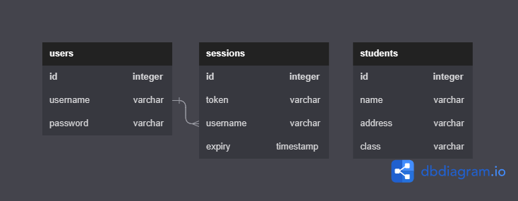

# Database Management

## Student Portal With DB

### Description

Student Portal ini adalah aplikasi Web Server API yang digunakan untuk mengakses data dari repositori `student` dengan melakukan autentikasi dengan data `user`. API ini memungkinkan pengguna untuk melakukan berbagai operasi **CRUD** _(Create, Read, Update, Delete)_ pada data `student`.

API ini memiliki dua endpoint yaitu: `/user` dan `/student`.

- Endpoint `/user` digunakan untuk mengelola _user authentication_.
- Endpoint `/student` digunakan untuk mengakses data student.

Pada setiap endpoint, API ini memiliki beberapa _sub-endpoint_ yang berfungsi untuk melakukan operasi CRUD pada data. Sub-endpoint tersebut meliputi:

- `/user`
  - `/register`: untuk mendaftarkan user baru di aplikasi
  - `/login`: untuk masuk ke aplikasi menggunakan user yang telah terdaftar
  - `/logout`: untuk keluar dari aplikasi

- `/student`
  - `/get-all`: untuk mengambil semua data
  - `/get`: untuk mengambil data dengan ID tertentu
  - `/add`: untuk menambahkan data baru
  - `/update`: untuk memperbarui data yang sudah ada
  - `/delete`: untuk menghapus data yang sudah ada

API ini dapat dijalankan dengan memanggil fungsi `Start()`, yang akan menampilkan pesan di console bahwa server sedang berjalan dan menjalankan server pada <http://localhost:8080>.

### Database Model and Schema



Aplikasi ini memiliki 3 tabel utama, yaitu `users`, `sessions`, dan `students`. Tabel `users` digunakan untuk menyimpan data-data user, tabel `sessions` digunakan untuk menyimpan data sesi token pada saat user login dan tabel `students` digunakan untuk menyimpan data student.

Tabel `users` hanya dapat memiliki satu sessions, dan tabel `sessions` dapat memiliki banyak users. Tabel `users` dan `sessions` memiliki relasi one-to-many sedangkan tabel `students` tidak memiliki relasi dengan tabel manapun.

> **Note**: aplikasi ini menggunakan Native SQL untuk management data repository ke database postgresql

### Constraints

Berikut adalah hal-hal yang harus diperhatikan dalam mengerjakan aplikasi student portal ini:

📁 **repository**

Ini adalah fungsi yang berinteraksi dengan database postgres

- **user**: `repository/user.go`
  - method `Add(user model.User)`: menerima parameter bertipe `model.User` dan berfungsi menyimpan data sesuai parameter tersebut ke tabel `users`
  - method `CheckAvail(user model.User)`: menerima parameter bertipe `model.User` dan berfungsi memeriksa ketersediaan data pada tabel `users` dengan ketentuan:
    - check berdasarkan field `username` dan `password` dari parameter yang diterima.
    - kembalikan `error` jika tidak ada
    - kembalikan `nil` jika ada
- **session**: `repository/session.go`
  - method `AddSessions(session model.Session)`: menerima parameter bertipe `model.Session` dan berfungsi menyimpan data sesuai parameter tersebut ke tabel `sessions`
  - method `UpdateSessions(session model.Session)`: menerima parameter bertipe `model.Session` dan berfungsi mengubah data session sesuai parameter tersebut ke tabel `sessions` dengan menggunakan parameter username sebagai target.
  - method `DeleteSession(token string)`: menerima parameter bertipe `string` dan berfungsi menghapus data tabel `sessions` sesuai dengan target token dari parameter yang diterima.
  - method `SessionAvailToken(token string)`: menerima parameter bertipe `string` dan berfungsi memeriksa apakah token tersedia dengan mengecek apakah nilai dari parameter sudah tersedia dalam kolom **token** pada tabel `sessions`.
    - jika session ditemukan, maka kembalikan data session dalam bentuk `model.Session` dan error `nil`
    - jika session **tidak** ditemukan, maka kembalikan data session kosong dalam bentuk `model.Session{}` dan error message
  - method `SessionAvailName(name string)`: menerima parameter bertipe `string` dan berfungsi memeriksa apakah token tersedia pada tabel `sessions` sesuai dengan kolom **name** sama dengan nilai dari parameter.
    - jika session ditemukan, maka kembalikan data session dalam bentuk `model.Session` dan error `nil`
    - jika session **tidak** ditemukan, maka kembalikan data session kosong dalam bentuk `model.Session{}` dan error message

- **student**: `repository/student.go`
  - `FetchAll`: Function ini akan mengambil semua data mahasiswa yang ada di dalam tabel `students` pada database. Selanjutnya, data mahasiswa tersebut akan di-scan dan dimasukkan ke dalam slice `[]model.Student`.
    - Jika proses tersebut berhasil, function akan mengembalikan slice tersebut beserta nilai `nil` sebagai `error`.
    - Namun jika terjadi error pada proses tersebut, function akan mengembalikan `nil` sebagai slice dan `error` yang terjadi.
  - `FetchByID`: Function ini akan mengambil data mahasiswa yang memiliki `id` yang sesuai dengan nilai yang diberikan sebagai argumen. Pertama-tama, function akan mengeksekusi sebuah query untuk mencari data mahasiswa dengan `id` yang sesuai. Hasil dari query tersebut akan di-scan ke dalam variabel `model.Student`.
    - Jika proses tersebut berhasil, function akan mengembalikan pointer `model.Student` beserta nilai `nil` sebagai `error`.
    - Namun jika terjadi error pada proses tersebut, function akan mengembalikan `nil` sebagai pointer dan `error` yang terjadi.
  - `Store`: Function ini akan menyimpan data mahasiswa yang diberikan sebagai argumen ke dalam database. Pertama-tama, function akan mengeksekusi sebuah query `INSERT` untuk memasukkan data mahasiswa baru ke dalam tabel `students`. Query tersebut akan menggunakan nilai dari variabel `model.Student` yang diberikan sebagai argumen.
    - Jika proses tersebut berhasil, function akan mengembalikan `nil` sebagai `error`.
    - Namun jika terjadi `error` pada proses tersebut, function akan mengembalikan `error` yang terjadi.
  - `Update`: Function ini akan mengupdate data mahasiswa yang memiliki `id` yang sesuai dengan nilai yang diberikan sebagai argumen. Pertama-tama, function akan mengeksekusi sebuah query `UPDATE` untuk mengubah data mahasiswa dengan `id` yang sesuai. Query tersebut akan menggunakan nilai dari variabel `model.Student` dan `id` yang diberikan sebagai argumen.
    - Jika proses tersebut berhasil, function akan mengembalikan `nil` sebagai `error`.
    - Namun jika terjadi `error` pada proses tersebut, function akan mengembalikan `error` yang terjadi.
  - `Delete`: Function ini akan menghapus data mahasiswa yang memiliki `id` yang sesuai dengan nilai yang diberikan sebagai argumen. Pertama-tama, function akan mengeksekusi sebuah query `DELETE` untuk menghapus data mahasiswa dengan `id` yang sesuai dari tabel `students`.
    - Jika proses tersebut berhasil, function akan mengembalikan `nil` sebagai `error`.
    - Namun jika terjadi `error` pada proses tersebut, function akan mengembalikan `error` yang terjadi.

### **Perhatian**

Sebelum kalian menjalankan `grader-cli test`, pastikan kalian sudah mengubah database credentials pada file **`main.go`** (line 69) dan **`main_test.go`** (line 23) sesuai dengan database kalian. Kalian cukup mengubah nilai dari  `"username"`, `"password"` dan `"database_name"`saja.

Contoh:

```go
dbCredentials = Credential{
    Host:         "localhost",
    Username:     "postgres", // <- ubah ini
    Password:     "postgres", // <- ubah ini
    DatabaseName: "kampusmerdeka", // <- ubah ini
    Port:         5432,
}
```

### Test Case Examples

#### Test Case 1

**Input**:

Untuk function `Store`, input yang diberikan adalah pointer ke `model.Student` yang berisi data mahasiswa baru yang ingin disimpan.

**Expected Output / Behavior**:

Function akan mengembalikan `error`. `error` akan bernilai `nil` jika tidak terjadi kesalahan, sedangkan jika terjadi kesalahan dalam menjalankan perintah SQL untuk menyimpan data mahasiswa baru, function akan mengembalikan `error` yang sesuai.

**Explanation**:

1. Function `Store` dipanggil dengan pointer ke `model.Student` yang berisi data mahasiswa baru yang ingin disimpan.
2. Function akan mengeksekusi perintah SQL yang akan menyimpan data mahasiswa baru ke tabel `students`.
3. Function ini akan mengembalikan `error` jika terjadi kesalahan saat memasukan data dan mengembalikan `nil` jika insert berhasil.

#### Test Case 2

**Input**:

Untuk function `FetchAll`, tidak memerlukan input apa pun.

**Expected Output / Behavior**:

Function akan mengembalikan slice of `model.Student` dan `error`. `error` akan bernilai `nil` jika tidak terjadi kesalahan, sedangkan slice `model.Student` akan berisi data seluruh mahasiswa yang ada dalam database.

**Explanation**:

1. Function `FetchAll` dipanggil.
2. Function akan mengeksekusi perintah SQL yang akan mengambil data seluruh mahasiswa dari tabel `students`.
3. Jika terjadi kesalahan dalam menjalankan perintah SQL, function akan mengembalikan `nil` dan `error` yang sesuai.
4. Function akan melakukan perulangan untuk setiap baris hasil query yang diperoleh.
5. Setiap baris hasil query yang diperoleh akan dimasukkan ke dalam slice `model.Student` menggunakan `append`.
6. Setelah semua baris hasil query dimasukkan ke dalam slice `model.Student`, function akan mengembalikan slice `model.Student` dan `error`.

#### Test Case 3

**Input**:

Untuk function `Update`, input yang diberikan adalah sebuah bilangan bulat `id` yang merepresentasikan ID mahasiswa yang ingin diupdate dan pointer ke `model.Student` yang berisi data mahasiswa yang baru.

**Expected Output / Behavior**:

Function akan mengembalikan `error`. `error` akan bernilai `nil` jika tidak terjadi kesalahan, sedangkan jika terjadi kesalahan dalam menjalankan perintah SQL, function akan mengembalikan `error` yang sesuai.

**Explanation**:

1. Function `Update` dipanggil dengan ID mahasiswa yang ingin diupdate dan data mahasiswa yang baru.
2. Function akan mengeksekusi perintah SQL dengan data mahasiswa yang diberikan dan ID mahasiswa yang ingin diupdate, yang akan mengupdate data mahasiswa yang memiliki ID tersebut pada tabel `students`.
3. Jika terjadi kesalahan dalam menjalankan perintah SQL, function akan mengembalikan `error` yang sesuai.
4. Jika tidak terjadi kesalahan, function akan mengembalikan `nil`.

### Note

Gunakan perintah curl untuk melakukan pengujian terhadap beberapa endpoint yang ada pada aplikasi di atas, contoh:

1. Untuk menambahkan data siswa baru:

   ```bash
   curl -X POST -H "Content-Type: application/json" -d '{"name": "Aditira", "address": "Jakarta", "class": "A"}' http://localhost:8080/student/add
   ```

2. Untuk mengambil semua data siswa:

   ```bash
   curl http://localhost:8080/student/get-all
   ```
